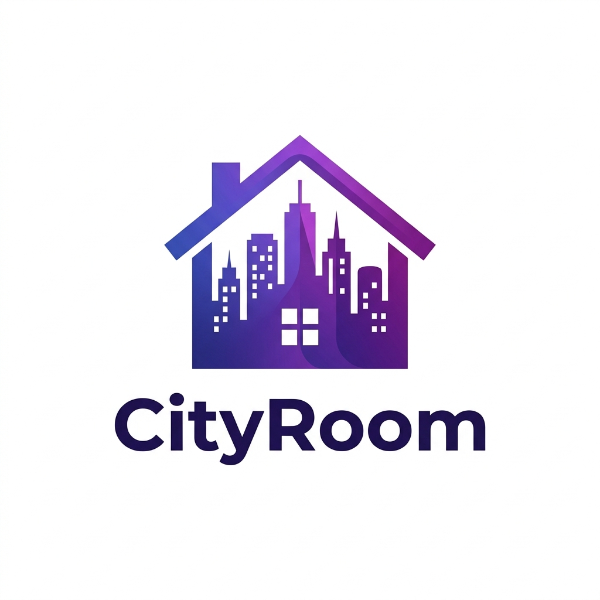

# Cityroom & Vlynxly
**Empowering Small-Town Real Estate & Modern Relationships**

**Contact Details:**
Shubh Katiyar, Founder & Owner
[Your Phone Number] | [Your Email]
[Your Website / LinkedIn]

---

## ⚠️ 1. The Problem

**For Small-Town Room Owners (Cityroom):**
- Struggle with visibility and rely on unorganized, word-of-mouth networks.
- Face high vacancy rates and lack basic digital tools to manage enquiries safely.

**For Modern Couples (Vlynxly):**
- Current dating apps fail to cater to couples looking to enrich an existing relationship.
- Lack of dedicated, private spaces to connect, plan, and communicate meaningfully.

---

## 💡 2. The Solution

**Cityroom:**
A hyper-local, unified platform that brings small-town room owners online. We provide map-based discovery and simple listing management.

**Vlynxly:**
A dedicated app beautifully designed for modern couples. It provides private, shared spaces to enhance communication and deepen connections.

---

## 📱 3. The Product

**Cityroom Features:**
- *Smart Map Discovery* for local renters.
- *Owner Dashboard* for effortless listing & enquiry management.

**Vlynxly Features:**
- *Private Couple's Dashboard* with shared calendars & messaging.
- *Relationship Milestones & Date Ideas.*

---

## 📊 4. Market Size

**Target Market in India:**
- **Small-Town Renters & Owners:** Millions migrating to Tier 2/Tier 3 cities needing affordable, localized housing.
- **Modern Couples:** Millions of young Indian couples seeking digital tools to manage and enhance their relationships.

*A massive, underserved TAM at the intersection of PropTech and RelationshipTech.*

---

## 💰 5. Business Model

**How we generate revenue:**
- **Freemium Subscriptions:** Premium tiers for advanced owner tools (Cityroom) and exclusive couple features (Vlynxly).
- **Featured Listings (Cityroom):** Small fee for room owners to boost listings.
- **In-App Purchases (Vlynxly):** Curated date packages and premium customizations.
- **Targeted Ads/Partnerships:** Local businesses, cafes, and event organizers.

---

## 🥊 6. Competition

**Cityroom vs. OYO / NoBroker:**
- Competitors focus heavily on Tier-1 cities or hotels with high brokerage.
- Cityroom targets the untapped Tier 2/3 room-rental market with zero-friction.

**Vlynxly vs. Tinder / Bumble / WhatsApp:**
- Competitors are built for singles or general messaging.
- Vlynxly is exclusively for established couples focusing on relationship enrichment.

---

## 🚀 7. Marketing Strategy

**Getting the First 1,000 Users:**
- **Hyper-Local Campaigns (Cityroom):** Ground-level marketing near colleges and community centers in target small towns.
- **Social Media & Influencers (Vlynxly):** Partnering with couple influencers on Instagram and YouTube.
- **Referral Programs:** Incentivizing early adopters (e.g., "Refer an owner, get a premium badge").

---

## 👥 8. The Team

**Shubh Katiyar, Founder & Owner**
- Background in building robust web and mobile applications.
- Deep understanding of the localized Indian market dynamics and modern app aesthetics.

---

## 💸 9. The Ask

**Seeking an Angel Investment of ₹6,000,000 – ₹8,000,000**

How the funds will be deployed:
- **50% Marketing & User Acquisition:** Aggressive local campaigns and digital ads.
- **35% Tech & Product Development:** Scaling backend infrastructure and enhancing mobile apps.
- **15% Operations & Team:** Legal, administrative, and hiring operational support.
